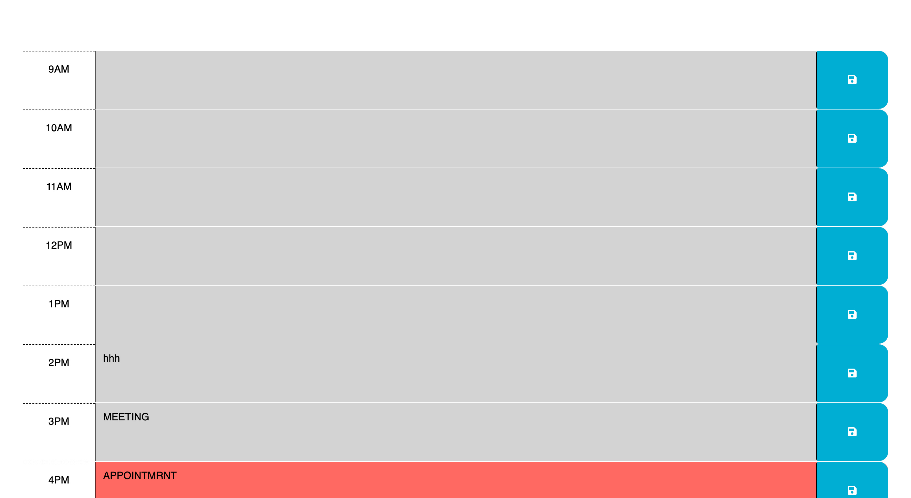

# Quest-5

  
  ## Description
  Workday Scheduler that uses the current time to determine   what is next to do 
  ## Deployed Application URL
  
  ## Screenshot
  
  ## Features
  Everything you type gets saved on to  local storage so even after yohu close the app you can go back and have everything saved. Another cool feature is the fcat that depending on the hour the color blocks changes. green for future, red for current and gray for past.
  ## Languages & Dependencies
  Javascript, HTML, css, JQuery and Local Storage
  ## How to Use This Application:
  Javascript HTML CSS JQuery and Local storage
 
  
